Welcome to the Mason documentation site!  
If you are new to Mason, check out [the quickstart article](quickstart.md).  
If you are familiar with Mason and want to shift to a poweruser workflow, visit [the standalone articles](standalone/installation.md).

## What Is Mason?

> Mason is a compiler that compiles project directories into BepInEx plugins that utilize Stratum asset loading, referred to as Stratum plugins.

But what does that mean?  
A compiler converts instructions from a format meant to be used by humans to a more machine-readable format. In this case, it converts a directory that contains a `manifest.json` and `project.yaml` into a DLL file. The DLL file is loaded by BepInEx as a BepInEx plugin, but it contains special instructions that call Stratum in order to load resources.

## How Is Mason + Stratum Better Than Deli?

The simple answer is that Mason + Stratum is more efficient and stable. It leverages existing tools (r2modman) and frameworks (BepInEx) to create a smaller, more efficient system, and does more work one time before launch rather than each time the game is launched. Mason also ensures that the format can be swapped at any time without breaking compatibility with pre-existing mods. Continue reading for a more detailed answer.

---

Deli and Mason must parse text files into structures, parse data within those structures (e.g. globbing), and then validate the final structure. However, Deli must do this for every mod, every time the game is launched. This also requires keeping the parsing code very rigid between versions, otherwise backwards compatibility is lost.  
With Mason, creators convey their intentions via the text files, run it once, and those intentions are immediately solidified into actions. Users no longer run parsing code, and creators can rest assured that the intentions of a released mod are not misconstrued by an update to the framework.

Similarly, Deli and Stratum both provide a system to load any type or quantity of assets, which may also depend on other assets. Using Deli, though, mods are separated from the BepInEx ecosystem and almost all mods are zipped. The separate ecosystem means Deli counterparts need to be made for pre-existing popular tools, such as HookGenPatcher and BepInEx.MonoMod.Patcher, thus wasting developer time. The large usage of zips means that asset bundles (generally large files) need to be read into memory before reading them into Unity, doubling the amount of memory usage.  
Stratum embraces BepInEx, leveraging the existing metadata to handle dependencies, incompatibilities, etc. This offloads work to a stable, pre-existing framework, and this offloading extends to the utility plugins described prior. Stratum has also has abandoned the idea of zipping assets into a single file, as it is assumed that all users (yes, even powerusers) are using r2modman at this point. In a way, r2modman does the zip work that Deli used to do, but only once when the mod is installed. This removes the need for loading asset bundles into memory and greatly reduces the scope of the project, making it easier to use and maintain.

Deli can be seen in its entirety here:

